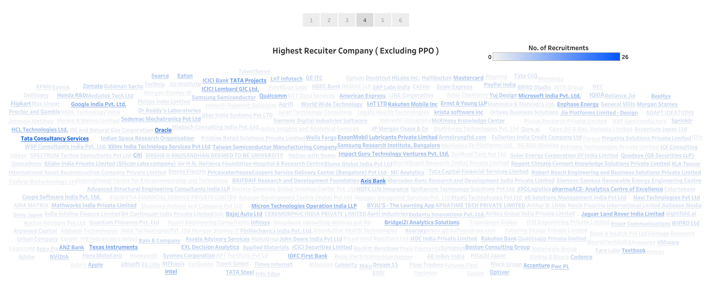

# IITB Placements 2021 Statistics

Placements in IIT Bombay; one of the India's premiere Engineering Institutes, is a huge thing. **1130+** students of **10+** different programs from **25+** different departments had been placed in **250+** different companies, over the Placement Season 2020-2021. This project contains data cleaning, data transformation and detailed analysis of entire IIT Bombay Placement-2021 data. Interactive *Story Points* and *Dashboards* are prepared and published in my [Tableau Public profile](https://public.tableau.com/app/profile/aniket.mondal/viz/IITB_Placement_2021/Story1).

This is different from the regular Placement report published by Institute. The regular one focuses more on showing the trends over the past 3-4 year, the participation rates and overall average gross salary. But this projects dives deep into identifying highest recruiting companies ( overall + program wise ), companies that recruits more than once in a same season. It also contains phase, program and department wise detailed recruitment analysis.

So, this project is not a substitution of the [official report](http://placements.iitb.ac.in/files/2021/Placement-and-internship-report-2020-21.pdf) but more like a compliment to it. As the data of previous years was not available with me, the official report helps in that case, as this project contains analysis in more details, this one shines.

## Some Visualizations created in Tableau

***Please visit my [Tableau Public Profile](https://public.tableau.com/app/profile/aniket.mondal/viz/IITB_Placement_2021/Story1) to interact with the visualizations. One can use filters, highlighters, selections, etc. accross all the vizualizations ( if applicable ) to get required insight.***

## Dataset

The data was taken from the IITB Placement Portal as `allocations.csv` and one ***should not use it for any kind of commertial purposes***. For potential **privacy** issues, the column containing names of the students has been ommitted from the `allocations.csv` file originally obtained.

[Go Top :arrow_up:](#iitb-placements-2021-statistics)
